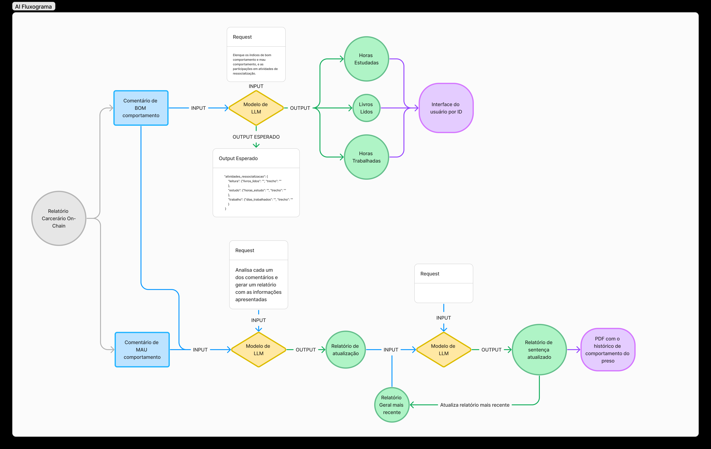
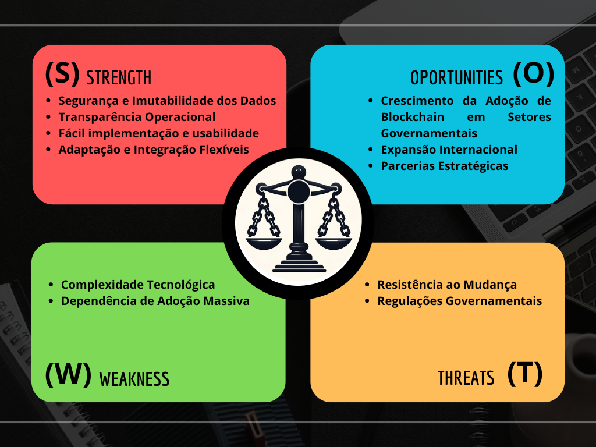
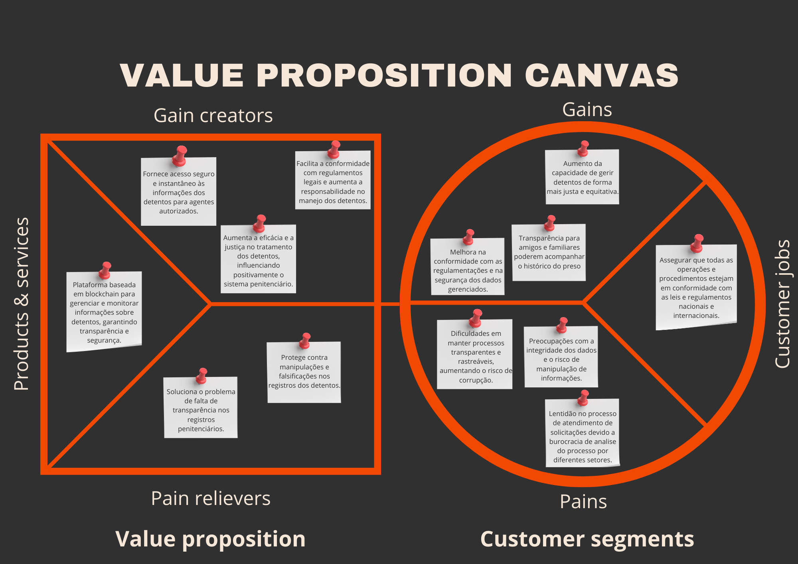

# Freedom Chains
<br>

[🇺🇸 Documentation](#USDocumentation)
[🇧🇷 Documentation](#BRDocumentation)

<br>

___

<a name="USDocumentation"></a>

🎨 [Figma](https://www.figma.com/file/9Ru5jjxZA5mLomAgVARDsQ/FreedomChains?type=design&node-id=0%3A1&mode=design&t=zAf4jQXI7qiX4nqA-1)

🎬 [Pitch](https://youtu.be/xaboVlYkYhM)

<br>

🎬 [Navigating through Freedom Chains](https://youtu.be/1hJH4Qg-MBw)

 
⚖️ Promoting justice and humanity in the Brazilian penal system, Freedom Chains offers a transparent, secure, and anonymous view of prisoners' behavioral history, strengthening the resocialization process and ensuring the rights of the incarcerated population.

⚙️ Solution developed using NextJS, ReactJs, TypeScript, Scroll

## Index

- 🌐 [General Scenario](#generalScenario): A perspective on the general scenario of the Brazilian prison system.
- 🎯 [Our Idea](#ourIdea): From the general perspective, how Freedom Chains intends to ensure a fair and humanitarian penal process.
- 📈 [Market Analysis](#marketAnalysis): Understanding the extent of the market and how we can generate social impact through its needs.
- 💻 [Technology Details](#technologyDetails): A deeper look at the technologies used in the development of the project.
- 👁️ [Where to Look in the Code](#whereToLookInTheCode): A focused inspection guide to orient the reviewer to each of the bounties.
- 📍 [Future Plans](#planosFuturos): A roadmap tohow we can improve our proposal.
- 😎 [Our Team](#ourTeam): Meet our members.

</br>
<a name="generalScenario"></a>

## 🌐 General Scenario

The Brazilian prison system is a complex and multifaceted issue that prompts discussions about justice, human rights, and the effectiveness of public policies. With one of the largest prison populations in the world, Brazil faces significant challenges related to overcrowding, violence, criminal recidivism, and adequate access to basic rights for detainees.

In this context, it is crucial to analyze and understand data related to detainees in the country, in order to identify trends, challenges, and opportunities for improvement in the prison system. This allows us to present a general overview of the most recent numbers and statistics about the Brazilian prison population, including information about the demographic profile of detainees, average prison time, incidence of provisional detention, and other relevant issues for the discussion about the criminal justice system.

Regarding detainees, according to the [Penal Information Report of 2023.2 (RELIPEN)](https://www.gov.br/senappen/pt-br/servicos/sisdepen/relatorios/relipen/relipen-2-semestre-de-2023.pdf), about 40% of all Brazilian prisoners are provisional detainees, meaning they have not yet been tried and sentenced, thus are detained provisionally and indefinitely. When talking about convicted inmates, the largest portions have total sentences between 20 and 100 years, of these, a large part still needs to serve more than 20 years in prison. Additionally, it is worth mentioning that, according to Brazilian legislation, convicted detainees can only serve a maximum of 30 years in prison, regardless of the time they were sentenced to.

It is worth pointing out that there are two [types of provisional detention](https://www.defensoriapublica.pr.def.br/Noticia/Quais-tipos-de-prisao-existem-no-Brasil): preventive detention and temporary detention. Preventive detention is ordered during the course of a criminal process, before the final judgment of the defendant. It aims to ensure public order, the convenience of criminal instruction, or the application of criminal law. It is generally used when there are indications that the accused may obstruct the investigation, flee justice, or represent a risk to society. On the other hand, temporary detention is a more specific precautionary measure, ordered in specific cases and for a determined period of up to 90 days, extendable in exceptional cases. It is applied during the investigation phase, allowing the police authority to gather evidence and clarify the facts. Both types of provisional detention are regulated by specific laws and must be used in a cautious and proportional manner, respecting the fundamental rights of the accused.

As for inmate rehabilitation programs, there are [3 ways to reduce a detainee's sentence](https://www.jusbrasil.com.br/artigos/3-formas-de-diminuir-a-pena-de-quem-esta-preso/1722654342) through educational and beneficial actions for the inmate. Firstly, if the inmate reads a book and writes a report about it, they receive a sentence remission of 3 days. Secondly, if they study, for every 12 hours of study they receive a sentence remission of 1 day. Lastly, if they work, for every 2 days of work they receive a sentence remission of 1 day.

In Brazil, the prison system faces [significant challenges](https://www.clp.org.br/uma-analise-do-sistema-prisional-brasileiro-problemas-e-solucoes/) that deserve our attention and action. Instead of being an environment for rehabilitation and justice, prisons often become places of rights deprivation and perpetuation of injustices. It is essential to recognize that rehabilitation programs are not always adequate, prioritizing punishment over the personal development of the inmate and their preparation for reintegration into society. This can contribute to a worrying cycle of criminal recidivism after release.

Moreover, it is crucial to address factors such as the lack of effective social rehabilitation programs, inequality, and discrimination, which contribute to the cycle of criminality. Without significant actions to reintegrate inmates into society, it is likely that many will return to crime after release.

In summary, a comprehensive review of the Brazilian prison system is necessary, focusing on reducing criminal recidivism, improving living conditions in prisons, and promoting the rehabilitation and social reintegration of inmates. This includes measures such as access to education and work opportunities, encouraging a successful transition back into society.

</br>

<a name="ourIdea"></a>

## 🎯 Our Idea

### The Problem

Given the general context of the Brazilian prison system, it is evident that it faces a series of challenges that directly impact the lives of individuals in incarceration, often resulting in unjustified prolongations of their sentences. These challenges include:

1. **Prejudice**: The incarcerated population faces significant stigmatization and discrimination from society in general, which can negatively influence judicial decisions and the execution of sentences. Prejudice can lead to unequal treatments before the law, harming the pursuit of justice and respect for human rights.
2. **Corruption**: Corruption within the judicial and prison system can distort legal processes, resulting in unfair decisions and favoring certain individuals over others. Corruption can be present from the initial phase of the process to the execution of sentences, compromising the efficacy and integrity of the system.
3. **Justice in Judgment**: The slowness and lack of transparency in judicial processes often result in prolonged preventive detentions and delays in the granting of release warrants. The sluggishness of the judicial system can lead to the imprisonment of individuals who are later found innocent or who have their sentences exceeding the necessary time, violating the principle of the presumption of innocence and the proportionality of sentences.
4. **Ease of Family Monitoring of the Prisoner's Situation**: The difficulty of access and communication between prisoners and their families makes it even more challenging to monitor the situation of the detainees. The lack of efficient communication channels can cause anguish and uncertainty among family members, making it difficult to provide the necessary assistance and support during the period of incarceration.

In summary, the challenges presented in the Brazilian prison system highlight the urgent need for structural reforms that ensure the efficacy of the judicial system, respect for human rights, and the promotion of the resocialization of inmates. Overcoming these obstacles requires not only legislative and policy measures but also a change in the model that values justice, transparency, and respect for the dignity of all individuals, regardless of their incarceration condition.

### Solution

In the context of the Brazilian prison system, Freedom Chains seeks to ensure that the resocialization process for inmates is more humane and transparent, aiming to remove possible biases. To address these problems, blockchain technology is used as a base, enabling the creation of a transparent portal for viewing the remaining time of sentence completion, behavioral histories, and rehabilitation indicators for future hearings. Through the creation of smart contracts, the Freedom Chains system adds unique identifiers for each inmate and associates them with behavioral smart contracts that carry reports made by prison agents to indicate good and bad behavior of an inmate, aiming to build a report that will serve as an indicator of fitness for resocialization.

In this solution, the [use of blockchain to solve the problem](#blockchainDetailing) is based on three pillars of this technology: transparency, immutability, and decentralization. Through blockchain, it is possible to ensure the integrity of the processes for evaluating inmate engagement with the rehabilitation process, as reports indicating life experiences in prison allow the verification of the validity and congruence of the evaluative process of the sentence. Thus, the use of a decentralization tool favors the reduction of systematic corruption in the Brazilian prison system, while ensuring greater agility in hearing processes, as the reports allow a more substantiated analysis of the case in question.

To ensure that the reports facilitate the analysis process by the judiciary, [LLM models](#AIDetailing) are used to convert the reports of good and bad behaviors associated with an inmate into a new report that groups comments and synthesizes the resocialization progress of the incarcerated through markers. In this way, the LLM model converts onchain data into analytical markers that facilitate the analysis of the inmate's profile and compose a behavioral dossier for different instances of judgment for reduction or increase in sentence.

Thus, the solution proposed by Freedom Chains emerges as a powerful response to the [challenges faced by the Brazilian prison system](https://www.clp.org.br/uma-analise-do-sistema-prisional-brasileiro-problemas-e-solucoes/). By employing blockchain technologies and advanced analytical models, this platform seeks not only to mitigate prejudices and combat corruption but also to ensure transparency and justice in the resocialization process of inmates. With this innovative approach, offering a tool to transparently track the completion of sentences and the progress of rehabilitation of prisoners, Freedom Chains enables a more substantiated and impartial analysis by the courts. This, in turn, reduces injustices and ensures that sentences are applied in a fair and proportional manner, strengthening the foundations of the judicial system.

Therefore, more than just technical efficiency, this solution reflects a deep commitment to the principles of justice, respect for human rights, and the dignity of all individuals, regardless of their incarceration situation. By promoting transparency, impartiality, and efficacy of the judicial system, Freedom Chains significantly contributes to building a more just and inclusive society. At its core is the belief that each person deserves the opportunity to seek their reintegration into the community in a dignified and equitable manner.

<a name="marketAnalysis"></a>

## 📈 Market Analysis

<br>

1. [SWOT Analysis](#SWOTAnalysis) - What is the internal and external environment of operation in the Brazilian prison system?
2. [Value Proposition Canvas](#valuePropositionCanvas) - Why is Freedom Chains the right path for resocialization processes?

<br>

<a name="SWOTAnalysis"></a>

### SWOT Analysis

The SWOT analysis is a strategic tool used to evaluate the strengths, weaknesses, opportunities, and threats of a company, project, or specific situation. It serves to provide a comprehensive view of an organization's internal and external environment, allowing for the identification of areas for improvement, competitive advantages, potential risks, and opportunities for growth. The SWOT analysis is important because it assists in formulating more effective strategies, making informed decisions, and developing action plans that leverage the organization's strengths and minimize its weaknesses, while seeking to capitalize on opportunities and mitigate external threats. Given this importance, here is the SWOT analysis of Freedom Chains in Figure 1:

<div align="center">
<sub><a name="f2"></a>SWOT Analysis (EN)</sub>

<sup>Source: Material produced by the authors (2024)</sup>
</div>

**Strengths:**

- Data Security and Immutability: Using the blockchain Scroll, the system ensures that data is stored securely and permanently, without the possibility of alteration or adulteration.
- Operational Transparency: Blockchain technology provides a high level of transparency, allowing all transactions to be accessible and verifiable by authorized parties, strengthening trust in the system.
- Easy Implementation and Usability: The efficiency of the blockchain Scroll in terms of very low transaction fees, facilitating the real implementation of the project with low concern for gas fees, compared to conventional systems.
- Flexible Adaptation and Integration: The ability to integrate with existing systems and adapt to specific regulations makes the system versatile and applicable in various jurisdictions.

**Weaknesses:**

- Technological Complexity: Although the use of blockchain is an advance into the future, the complex nature of blockchain can be a barrier at the current time in which Brazil is, especially in adoption by non-technical users, such as prison administrators who may have limitations in understanding and operating the technology.
- Dependence on Massive Adoption: The efficacy of the system depends on the consistent adoption and use by all involved parties, from prison system employees to regulatory bodies. Clearly, this is an issue that can be overcome by clarifying all the advantages of the platform, however, it is a point that should not be ignored.

**Opportunities:**

- Growth in Blockchain Adoption in Government Sectors: With the increasing interest and confidence in blockchain technologies by government sectors, there is a significant opportunity for expansion and establishment as a market leader in technological solutions for prison administration.
- Strategic Partnerships: Establishing partnerships with government agencies and international organizations can facilitate implementation and promote favorable regulatory standards.
- International Expansion: Exploring international markets where prison management faces similar challenges can broaden the reach and applicability of the system.

**Threats:**

- Resistance to Change: The hesitation or opposition to abandoning traditional systems by established institutions may limit the adoption of the new technology in this first instance.
- Government Regulations: Unexpected regulatory changes or strict regulations regarding blockchain as a whole can affect the implementation and operation of the system.

In conclusion, although there are challenges to be overcome, Freedom Chains is well-positioned to capitalize on its strengths and opportunities, while proactively facing its weaknesses and threats. With a strategic approach and a continuous focus on innovation and adaptation, the application can consolidate itself as the main means of fair management of inmates.

<a name="valuePropositionCanvas"></a>

### Value Proposition Canvas

The Value Proposition Canvas is a visual and strategic tool used for the development of products, solutions, and projects. This utility focuses on ensuring that a proposed solution meets the needs and desires of the customers. It helps map and understand the benefits that the proposed solution should offer to meet customer requests and create significant gains for them.

<div align="center">
<sub><a name="f2"></a>Value Proposition Canvas (EN)</sub>

<sup>Source: Material produced by the authors (2024)</sup>
</div>

**In the "Customer Segments" section, the three main components presented seek to bring the role of the customer in the current business model and how the solution can impact them.**

1. Customer Jobs:

- Ensure that all operations and procedures comply with national and international laws and regulations.

  Currently, prison agents and administrators face the challenge of managing sensitive and confidential data securely and efficiently, often dealing with outdated systems that do not offer data integrity guarantees and without guarantees of transparency or immutability.

2. Pains:

- Difficulties in maintaining transparent and traceable processes, increasing the risk of corruption.
- Concerns about data integrity and the risk of information manipulation.
- Slowness in the process of responding to requests due to bureaucracy in the analysis process by different sectors.

  The lack of a reliable and transparent system can result in operational inefficiencies and failures in the administration of justice, in addition to increasing the risk of corruption and data manipulation in the prison system. Moreover, having a more straightforward, efficient, and transparent platform can assist in raising information to speed up processes.

3. Gains:

- Increased capacity to manage inmates more fairly and equitably.
- Transparency for friends and family to monitor the prisoner's history.
- Improvement in compliance with regulations and the security of managed data.

**In the "Value Proposition" section, there are three main components highlighted in the figure, which seek to bring the role of the corporation in the proposed business model.**

1. Products and Services:

- Blockchain-Based Platform for Inmate Management: The platform serves as an immutable and transparent record of inmate information, allowing the consistent and secure monitoring of penitentiary records.

  The platform functions as a distributed ledger that stores detailed data about inmates, including behavioral history, rehabilitation progress, and important sentence review dates, all accessible in real-time to facilitate the effective administration of the prison system.

2. Gain Creators:

- Provides secure and instant access to inmate information for authorized agents.
- Increases the effectiveness and fairness in the treatment of inmates, positively influencing the penitentiary system.
- Facilitates compliance with legal regulations and increases accountability in the handling of inmates.

  By using a blockchain-based platform, the project aims to provide a reliable and secure way to access and record information, which is crucial for the fair operation of the prison system. Additionally, by reducing the need for manual interactions and bureaucratic processes, the platform optimizes resources and decreases expenses.

3. Pain Relievers:

- Protects against manipulations and forgeries in inmate records.
- Solves the problem of lack of transparency in penitentiary records.

  Blockchain technology ensures that each transaction is recorded securely and permanently, providing an indisputable source of truth.

By integrating the blockchain platform into the prison system, administrators will be able to access a tool that not only facilitates record management but also reinforces trust in the system, providing a verifiable and transparent way to track the trajectory and behavior of inmates, contributing significantly to reform and continuous improvement of penitentiary practices. Additionally, the law must undoubtedly be followed, given that all records will be deployed and cannot be hidden.

The detailed analysis of the Value Proposition Canvas reveals a robust and innovative solution for the challenges faced by prison systems. By integrating blockchain technology, the proposed platform seeks not only to modernize but also to fundamentally reform inmate management, offering unprecedented transparency, security, and efficiency. With a clear focus on customer benefits, the proposal aims to alleviate the pains faced by prison agents and administrators, providing a reliable and transparent solution for managing sensitive data. At the same time, it offers tangible gains, such as increased fairness in the treatment of inmates, transparency for friends and family, and improved regulatory compliance.

<a name="technologyDetails"></a>

## 💻 Technology Details

<br>

1. [Blockchain Usage Details](#blockchainDetailing) - How did Freedom Chains apply blockchain to enhance the security and transparency of the prison system?
2. [Artificial Intelligence Usage Details](#AIDetailing) - How did Freedom Chains use Artificial Intelligence to facilitate the monitoring of the resocialization process of people in incarceration?

<br>

<a name="blockchainDetailing"></a>

### Blockchain

In the context of the National Prison Administration System (SNAP), the system for registration and verification of prisoners seeks to address challenges related to the transparency of an inmate's penal information. To address these problems, blockchain technology is used as a base, enabling the creation of a transparent portal for updating inmate data. Through the use of smart contracts, the owner allows authorized and verified prison agents, through the confirmation of identity and credentials, to add to the inmates their initial ID registrations and behavioral information capable of altering the expected length of the sentence. Thus, the criminal history data of each inmate can be collected by the agents and added to the blockchain through smart contracts, ensuring the immutability of that information and transparency in the sentence monitoring process.

In this perspective, for the implementation of this project, it was necessary to create a smart contract capable of storing ID information, dates of imprisonment and expected end of sentence, indicators of good/bad behavior along with comments justifying them. For this, the language `Solidity` was used as the main technology; in addition, it was naturally necessary to deploy this contract using `EVM` technology through [Remix](https://remix.ethereum.org).

**System Characteristics**

*Data Launch to Blockchain*

The registration and monitoring system uses blockchain technology to ensure the immutability and transparency of the records. The main data recorded includes:
- Prisoner ID: Unique identification for each inmate.
- Date of Imprisonment: Timestamp of the start date of detention.
- Expected Release: Timestamp of the expected release date.
- Detention Status: Indicator if the prisoner is currently detained or not.
- Behavior Records: Entries documenting the inmate's behavior, which may include "Good Behavior" or "Bad Behavior," with relevant comments.

*Access Control*

To ensure that only authorized agents manipulate the information of the inmates, the system implements strict access control. The contract administrator (owner) has the ability to authorize or revoke access for specific wallets, ensuring that only qualified and approved personnel can add or change the records. This security layer is vital to maintaining the integrity and confidentiality of the inmates' data.

*Display Filtered Data*

The application can pull data already deployed on the blockchain and bring it back with filters, aiming to assist user visualization. The data return functions include:
- List all IDs registered in the system along with all information attached to the inmate.
- List the entire history of an inmate with a searchable ID, making it possible to identify points of good/bad behavior and a comment that justifies it.
- View the record of inmates along with their dates of imprisonment and expected end of sentence.

These functionalities can meet the difficulties found in the process, fulfilling the objective of the solution. For this, a smart contract was developed.

The contract can be viewed below:

```solidity
// SPDX-License-Identifier: MIT
pragma solidity ^0.8.24;

import "@openzeppelin/contracts/access/Ownable.sol";

/**
 * @title PrisonerManagementSystem
 * @dev This contract manages basic information and behavior records of inmates,
 * with access restrictions controlled by the contract owner.
 */
contract PrisonerManagementSystem is Ownable {
    struct PrisonerInfo {
        uint256 id;
        uint256 prisonDate;
        uint256 releaseDate;
        bool isDetained;
        address createdBy;
        bytes32 transactionHash;
    }

    struct BehaviorRecord {
        uint256 date;
        string behavior;
        string comment;
    }

    uint256[] private prisonerIds;  
    mapping(uint256 => PrisonerInfo) public prisonerInfo;
    mapping(uint256 => BehaviorRecord[]) public behaviorRecords;
    mapping(address => bool) public authorized;  
    address[] private authorizedAddresses;  

    event PrisonerInfoRegistered(
        uint256 indexed prisonerId,
        uint256 prisonDate,
        uint256 releaseDate,
        bool isDetained,
        address createdBy,
        bytes32 transactionHash
    );
    event BehaviorRecordAdded(uint256 indexed prisonerId, string behavior, string comment);
    event AuthorizationUpdated(address indexed agent, bool isAuthorized);
    event NewPrisonerID(uint256 prisonerId);  

    constructor() Ownable(0xe56F3e90B6faB303B191f8195Df3933f88aad297) {
        authorized[msg.sender] = true; 
        authorizedAddresses.push(msg.sender);  // Add the owner to the array of authorized addresses
    }

    modifier onlyAuthorized() {
        require(authorized[msg.sender], "You are not authorized to perform this action");
        _;
    }

    function authorizeAgent(address _agent, bool _isAuthorized) public onlyOwner {
        authorized[_agent] = _isAuthorized;
        if (_isAuthorized && !isAlreadyAuthorized(_agent)) {
            authorizedAddresses.push(_agent);
        } else if (!_isAuthorized) {
            removeAuthorizedAddress(_agent);
        }
        emit AuthorizationUpdated(_agent, _isAuthorized);
    }

    function getAuthorizedAddresses() public view returns (address[] memory) {
        return authorizedAddresses;
    }

    function isAlreadyAuthorized(address _agent) private view returns (bool) {
        for (uint i = 0; i < authorizedAddresses.length; i++) {
            if (authorizedAddresses[i] == _agent) {
                return true;
            }
        }
        return false;
    }

    function removeAuthorizedAddress(address _agent) private {
        uint index = 0;
        bool found = false;
        for (uint i = 0; i < authorizedAddresses.length; i++) {
            if (authorizedAddresses[i] == _agent) {
                index = i;
                found=true;
                break;
            }
        }
        if (found) {
            authorizedAddresses[index] = authorizedAddresses[authorizedAddresses.length - 1];
            authorizedAddresses.pop();
        }
    }

      function registerPrisonerInfo(uint256 _id, uint256 _prisonDate, uint256 _releaseDate, bool _isDetained) public onlyAuthorized {
        PrisonerInfo memory info = PrisonerInfo({
            id: _id,
            prisonDate: _prisonDate,
            releaseDate: _releaseDate,
            isDetained: _isDetained,
            createdBy: msg.sender,
            transactionHash: bytes32(0) // Placeholder for actual transaction hash retrieval
        });
        prisonerInfo[_id] = info;
        prisonerIds.push(_id);
        emit PrisonerInfoRegistered(_id, _prisonDate, _releaseDate, _isDetained, msg.sender, bytes32(0));
        emit NewPrisonerID(_id);
    }

    function getAllPrisonerDetails() public view returns (PrisonerInfo[] memory) {
        PrisonerInfo[] memory details = new PrisonerInfo[](prisonerIds.length);
        for (uint256 i = 0; i < prisonerIds.length; i++) {
            uint256 id = prisonerIds[i];
            details[i] = prisonerInfo[id];
        }
        return details;
    }

       function addBehaviorRecord(uint256 _id, string memory _behavior, string memory _comment) public onlyAuthorized {
        behaviorRecords[_id].push(BehaviorRecord({
            date: block.timestamp,
            behavior: _behavior,
            comment: _comment
        }));
        emit BehaviorRecordAdded(_id, _behavior, _comment);
    }

    function getPrisonerInfo(uint256 _id) public view returns (PrisonerInfo memory) {
        return prisonerInfo[_id];
    }

     function getBehaviorRecords(uint256 _id) public view returns (BehaviorRecord[] memory) {
        return behaviorRecords[_id];
    }

    function getAllPrisonerIDs() public view returns (uint256[] memory) {
        return prisonerIds;
    }
}

```

Moreover, MetaMask was chosen as the digital wallet technology, serving as a means for deployment directly on the Scroll test network. Within the project, it also acts as a gateway to allow users to interact with the Ethereum blockchain directly from their web browsers. It is an essential tool for facilitating secure access, providing a user-friendly interface to authenticate deployments. This significantly simplifies the interaction of prison agents with the system, allowing them to perform transactions and queries without requiring deep technical knowledge about smart contracts or blockchain.

- Implementation of the Token for Loyalty

To promote the loyalty of prison agents and encourage adherence to the National Prison Administration System (SNAP), we implemented a reward system based on tokens, named "FreedomChains" (FDC). The FDC token is a motivation tool designed to reward agents for the diligent and accurate registration of behavioral information of inmates. Each action of registration on the blockchain generates a certain amount of FDC tokens for the responsible agent, which can later be exchanged for tangible benefits, such as extra paid vacations. This approach not only improves the quality of data entered into the system but also engages prison agents, turning them into active and committed participants in the accuracy of the system.

- Choice of Token and Blockchain Technology

The choice to implement the FDC token through an ERC-20 smart contract was guided by the need for a robust, scalable solution integrated into the Ethereum ecosystem. We used the rapid contract creation tool from [OpenZeppelin](https://www.openzeppelin.com/contracts). The FDC contract allows the minting of tokens directly related to the actions of the agents in the system, ensuring a fair and transparent distribution of rewards.
The contract can be viewed below:
```
// SPDX-License-Identifier: MIT
// Compatible with OpenZeppelin Contracts ^5.0.0
pragma solidity ^0.8.20;

import "@openzeppelin/contracts/token/ERC20/ERC20.sol";
import "@openzeppelin/contracts/token/ERC20/extensions/ERC20Burnable.sol";
import "@openzeppelin/contracts/access/Ownable.sol";

contract FDC is ERC20, ERC20Burnable, Ownable {
    constructor(address initialOwner)
        ERC20("FreedomChains", "FDC")
        Ownable(initialOwner)
    {}

    function mint(address to, uint256 amount) public {
        _mint(to, amount);
    }
}
```

## Lumx Protocol API Integration

Integrating the Lumx Protocol API was a strategic decision crucial for the success of the project. Known for its innovation and technological excellence, Lumx Protocol offers a robust and highly secure platform for blockchain application development. Opting for Lumx Protocol not only allowed us to implement complex functionalities with ease but also ensured the security and reliability of our reward system. The ability to interact with the contract to perform mint operations is a testament to the flexibility and efficiency of the Lumx Protocol. The Lumx API stands out for its intuitive interface and exceptional support, facilitating seamless integration and enabling our team to focus on optimizing user experience and system functionality.

The introduction of the FDC token within SNAP has created a motivating environment for agents, encouraging consistency and accuracy in data recording. Moreover, the tokenization of rewards enhances the transparency of operations, as each transaction and token accumulation are recorded on the blockchain, providing complete visibility for system administrators and agents. Implementing this token system aligns our initiative with modern scopes of loyalty and digital engagement and redefines how penitentiary operations can be managed, offering a replicable model for other institutions seeking to modernize and improve their systems through blockchain technology.

Using tokens as a loyalty mechanism represents a significant innovation in penitentiary administration, providing a tangible incentive for the continuous improvement of agent performance. Despite some technical challenges, the partnership with Lumx Protocol has proven to be extremely valuable, allowing us to explore new frontiers in blockchain technology and data security, setting a new standard of efficacy and efficiency within the public sector.

In summary, implementing the prisoner registration and monitoring system within the context of the National Penitentiary Administration System (SNAP) demonstrates how blockchain technology, combined with smart contracts and a user-friendly interface like MetaMask, can revolutionize transparency and efficiency in penitentiary management. By providing a transparent portal for updating inmate data and recording behaviors through smart contracts, the system promotes the immutability of information and the integrity of each prisoner's criminal history. This not only simplifies the monitoring process but also enhances trust in prison administration by ensuring a fairer and more transparent approach. Ultimately, this initiative represents a significant advance in modernizing the prison system, aiming for more effective and humane management, and ensuring effectiveness through customer loyalty.

<a name="AIDetailing"></a>

### Artificial Intelligence

The project benefits from integrating artificial intelligence (AI) in a blockchain application project aimed at generating reports on inmates. AI is used to process comments from prison officers and generate standardized reports, providing valuable insights into inmate behavior.

The flowchart visually demonstrates how Artificial Intelligence is used to automate processes and assist in report generation and calculation of sentence reductions for the convict:



AI operates in several stages to process the data from comments and generate the final reports:

1. **Pre-processing of comments:** Comments from prison officers undergo a pre-processing stage for data cleaning and normalization. This includes removing noise such as unnecessary punctuation, case sensitivity, and irrelevant words, as well as stripping any mention of personal names to ensure the privacy of the inmate.

   Example of a prison officer's comment:
   ```
   The inmate has shown considerable dedication to his studies this month, completing approximately 36 hours in professional requalification courses. Additionally, he read and wrote reports on 3 different books, contributing positively to his sentence reduction.
   ```
2. **Information Extraction:** After processing the comments submitted by the prison officer, AI extracts relevant information from the comments. This includes identifying good and bad behaviors mentioned by prison officers, as well as any resocialization actions undertaken by inmates.

   Example of the JSON generated after information extraction:
   ```
   {
       "comment": "This month, the inmate completed three more books, showing a continuous dedication to studies and increasing awareness of his rehabilitation. Maintains good behavior and cooperation.",
       "comment_date": "07/12/2023",
       "good_behavior_indices": [
           "Continuous dedication to studies",
           "Awareness of the importance of rehabilitation",
           "Good behavior and constant cooperation"
       ],
       "bad_behavior_indices": [],
       "resocialization_activities": {
           "reading": {
               "books_read": "3",
               "snippet": "completed three more books"
           },
           "study": {
               "study_hours": "36",
               "snippet": "continuous dedication to studies"
           },
           "work": {
               "work_days": "30",
               "snippet": "showing continuous dedication"
           }
       }
   }
   ```
3. **Report Generation:** Based on the extracted information, AI generates detailed reports on inmate behavior. The reports include lists of good and bad behaviors, recurrences of these behaviors, and resocialization actions. Each piece of information is associated with the date of the corresponding comment.

   Example of a report:
   ```
   ### 1 - List of bad behaviors, with the corresponding comment date


   | Bad Behavior                                   | Comment Date |
   |------------------------------------------------|--------------|
   | Involved in a fight with another inmate        | 10/18/2023   |
   | Did not participate in resocialization activities | 10/18/2023 |
   | Disobeyed prison rules                         | 10/18/2023   |
   | Aggressive behavior                            | 10/22/2023   |
   | Lack of cooperation with guards                | 10/22/2023   |
   | Refused to work in gardening                   | 10/22/2023   |
   | Neglected educational responsibilities         | 10/28/2023   |
   | Attempted smuggling of unauthorized items      | 10/28/2023   |
   | Disrespect for prison rules                    | 10/28/2023   |

   ### 2 - List of recurrences of bad behaviors

   | Bad Behavior                      | Frequency |
   |-----------------------------------|-----------|
   | Disobeyed prison rules            | 2         |
   | Disrespect for prison rules       | 2         |

   ### 3 - List of good behaviors, with the corresponding comment date

   | Good Behavior                                | Comment Date |
   |----------------------------------------------|--------------|
   | Read 5 books in one month                    | 10/15/2023   |
   | Wrote detailed reports for each book         | 10/15/2023   |
   | Worked every business day of the month in the workshop | 10/15/2023 |
   | Read 4 new books                             | 10/20/2023   |
   | Completed 36 hours of study in carpentry     | 10/20/2023   |
   | Maintained constant involvement in activities| 10/20/2023   |
   | Actively participated in high school classes | 10/25/2023   |
   | Worked diligently in the laundry             | 10/25/2023   |
   | Demonstrated respect and continuous cooperation | 10/25/2023 |

   ### 4 - List of recurrences of good behaviors

   | Good Behavior                        | Frequency |
   |--------------------------------------|-----------|
   | Constant and diligent work           | 2         |
   | Active participation in activities   | 2         |

   ### 5 - Resocialization Actions

   - **Reading:**
     - Total books read: 9

   - **Study:**
     - Total study hours: 96 hours (36 hours in carpentry, 60 hours high school)

   - **Work:**
     - Total work days: 44 (22 days in laundry workshop, 22 days in other work)
   ```
4. **Report Comparison:** When a new report is generated, it is compared with the last report generated for the same inmate. This allows for identifying changes in behavior over time. AI calculates averages and other metrics to highlight these changes and provide insights into the inmate's progress, whether positive or negative.

Additionally, it is worth mentioning that **the LLM model is instructed to censor any name or any information that might compromise the security of those mentioned**. This is done to prevent data leaks and ensure the security and privacy of all involved in the process, as well as to avoid biases and prejudices by those using the platform.

For the development of the backend related to the LLM, the following technologies were used:

* **Natural Language Processing (NLP)**: Used for sentiment analysis and information extraction from comments.
- **Machine Learning Algorithms**: Implemented for text classification, report generation, and data comparison.
- **Blockchain**: Used to securely and immutably store comments from prison officers and reports generated by AI.
- **Database**: Stores temporary and final data for processing and querying.

The integration of artificial intelligence in this blockchain application project brings significant benefits by automating the report generation process about inmates. This not only increases operational efficiency but also provides valuable insights to assist in penitentiary management decisions. AI contributes to a more proactive and informed approach in treating and monitoring inmates, promoting better outcomes in resocialization and social reintegration.

<a name="futurePlans"></a>

## 📍 Future Plans

*Expansion of Functional Coverage:*
- *Automated Judicial Monitoring:* Develop features that allow automated monitoring of judicial cases associated with inmates, integrating with court systems for real-time updates.
- *Management of Educational and Work Resources:* Expand the system to manage and record educational and work activities of prisoners, including completed courses and acquired skills.

*Integration with Other Platforms and Services:*
- *APIs for Integration with NGOs and Social Services:* Enable non-governmental organizations and social services to access information about inmate progress to facilitate reintegration programs.
- *Connection with Employment Platforms:* Create partnerships with employment platforms to help ex-inmates find work post-release.

*Security and Privacy Improvements:*
- *Frequent Security Audits:* Implement regular security audits to ensure that inmate data

 is kept secure and private.

*Advanced Data Analysis and AI:*
- *Resocialization Prediction:* Use machine learning models to predict resocialization success based on inmate behavior and engagement in productive activities.
- *Anomaly Detection:* Implement anomaly detection algorithms to automatically identify suspicious data entries or inconsistencies in reports.

*Geographic Expansion:*
- *Adaptation for Other Legal Systems:* Adapt the software to be compatible with prison systems of other countries, considering their specific laws and regulations.

<a name="whereToLookInTheCode"></a>

## 👁️ Where to Look in the Code

### Scroll

Contract: 0x13258E8be2e5b99A462f7F20b80035Bfcbe009f5 `<br/>`
Contract link on [Scroll Etherscan](https://sepolia.scrollscan.com/address/0x6f152c6bf0a8c692e66fe7c1cf2c29b7d4ece37a)

Scroll is a notably efficient blockchain platform, distinguished by its operational viability. We chose Scroll as the foundation for our project due to its extremely stable network and reduced gas fee costs, crucial elements for a viable and practical implementation in real-life scenarios. This strategic choice ensures that our application is not only sustainable but also broadly accessible, democratizing access to cutting-edge technologies in critical public administration systems and guaranteeing an innovative solution that promises to transform how we interact with vital governmental infrastructures.

### Lumx

Lumx is a blockchain platform that stands out for its innovation and robustness, providing a highly efficient development environment for our projects. We chose Lumx as the basis for our initiative due to its ease and intuitiveness in dealing with blockchain technologies in a less complex and more user-friendly manner. This strategic decision ensures that our application is not only sustainable but also highly efficient, democratizing access to advanced technologies in essential public administration systems and offering an innovative solution that promises to revolutionize how government infrastructures interact and operate. Lumx, with its exemplary support and cutting-edge technology, allows for smooth integration and reliable operation, ensuring that our project can achieve and exceed its goals successfully.

<a name="ourTeam"></a>

## 😎 Our Team

<table>
  <tr>
    <td align="center">
      <a href="https://www.linkedin.com/in/gustavo-dacosta/">
        <br>
        <sub>
          <b>Gustavo Gonçalves</b>
        </sub>
      </a>
    </td>
  <td align="center"> 
      <a href="https://www.linkedin.com/in/joaolimamarinho/">
        <br>
        <sub>
          <b>João Lima</b>
        </sub>
      </a>
    </td>
    <td align="center">
      <a href="https://www.linkedin.com/in/kesneylucas/">
        <br>
        <sub>
          <b>Kesney Lucas</b>
        </sub>
      </a>
    </td>
    <td align="center">
      <a href="https://www.linkedin.com/in/thiagovolcati">
        <br>
        <sub>
          <b>Thiago Volcati</b>
        </sub>
      </a>
    </td>
  </tr>
</table>

---


# Freedom Chains

<br>

[🇺🇸 Documentation](#USDocumentation)
[🇧🇷 Documentation](#BRDocumentation)

<br>

___

<a name="BRDocumentation"></a>

🎨 [Figma](https://www.figma.com/file/9Ru5jjxZA5mLomAgVARDsQ/FreedomChains?type=design&node-id=0%3A1&mode=design&t=zAf4jQXI7qiX4nqA-1)

🎬 [Pitch](https://youtu.be/xaboVlYkYhM)

<br>

🎬 [Navegando pela FreedomChains](https://youtu.be/1hJH4Qg-MBw)

⚖️ Promovendo justiça e humanidade no sistema penal brasileiro, Freedom Chain oferece uma visão transparente, segura e anônima do histórico comportamental dos presos, fortalecendo o processo de ressocialização e garantindo os direitos da população carcerária.

⚙️ Solução desenvolvida usando NextJS, ReactJs, Typescript, Scroll

## Índice

- 🌐 [Cenário Geral](#cenarioGeral): Uma perspectiva do cenário geral do sistema carcerário no Brasil.
- 🎯 [Nossa Ideia](#nossaIdeia): A partir da perspectiva geral, como a Freedom Chains pretender garantir um processo penal justo e humanitário.
- 📈 [Análise de Mercado](#analiseDeMercado): Entendendo a extensão do mercado e como podemos, por meio das necessidades desse mercado gerar impacto social.
- 💻 [Detalhamento de Tecnologias](#detalhamentoDeTecnologias): Uma visão mais aprofundada das tecnologias utilizadas no desenvolvimento do projeto
- 👁️ [Onde olhar no código](#ondeOlharNoCodigo): Um guia de inspeção focado em orientar o revisor para cada uma das *bounties*.
- 📍 [Planos Futuros](#planosFuturos): Uma prospecção de como podemos melhorar a nossa proposta.
- 😎 [Nossa Equipe](#nossaEquipe): Conheça os nossos membros.

</br>
<a name="cenarioGeral"></a>

## 🌐 Cenário Geral

O sistema carcerário brasileiro é um tema complexo e multifacetado, que suscita debates sobre justiça, direitos humanos e eficácia das políticas públicas. Com uma população carcerária que figura entre as maiores do mundo, o Brasil enfrenta desafios significativos relacionados à superlotação, violência, reincidência criminal e acesso adequado a direitos básicos dos detentos.

Neste contexto, é crucial analisar e compreender os dados relacionados aos detentos no país, a fim de identificar tendências, desafios e oportunidades de melhoria no sistema prisional. Dessa forma, é possível apresentar uma visão geral dos números e estatísticas mais recentes sobre a população carcerária brasileira, incluindo informações sobre o perfil demográfico dos detentos, o tempo médio de prisão, a incidência de prisão provisória e outras questões relevantes para o debate sobre o sistema de justiça criminal no Brasil.

Em relação aos detentos, conforme o [Relatório de Informações Penais de 2023.2 (RELIPEN)](https://www.gov.br/senappen/pt-br/servicos/sisdepen/relatorios/relipen/relipen-2-semestre-de-2023.pdf), cerca de 40% de todos os presidiários do Brasil são presos provisórios, ou seja, ainda não foram julgados e sentenciados, logo estão presos de forma provisória e por tempo indeterminado. Quando falamos de detentos condenados, as maiores parcelas de detentos possuem pena total entre 20 e 100 anos de pena, desses, grande parte ainda precisa cumprir mais de 20 anos de cadeia.
Além disso, é válido mencionar que, de acordo com a legislação brasileira, os detentos condenados só podem cumprir no máximo 30 anos de cadeia, independente do tempo de pena a qual eles foram condenados.

É válido pontuar que existem dois [tipos de prisão provisória](https://www.defensoriapublica.pr.def.br/Noticia/Quais-tipos-de-prisao-existem-no-Brasil): a prisão preventiva e a prisão temporária. A prisão preventiva é decretada durante o curso do processo criminal, antes do julgamento final do réu. Ela visa garantir a ordem pública, a conveniência da instrução criminal ou a aplicação da lei penal. Geralmente, é utilizada quando há indícios de que o acusado possa obstruir a investigação, fugir da justiça ou representar um risco à sociedade. Por outro lado, a prisão temporária é uma medida cautelar mais específica, decretada em casos específicos e por um prazo determinado de até 90 dias, prorrogável em casos excepcionais. Ela é aplicada durante a fase de investigação, permitindo que a autoridade policial reúna provas e esclareça os fatos. Ambos os tipos de prisão provisória são regulamentados por leis específicas e devem ser utilizados de forma criteriosa e proporcional, respeitando os direitos fundamentais dos acusados.

Como forma de programas de reabilitação de detentos, existem [3 formas de diminuir a pena](https://www.jusbrasil.com.br/artigos/3-formas-de-diminuir-a-pena-de-quem-esta-preso/1722654342) de um detento através de ações educacionais e benéficas ao detento, primeiramente, caso o detento leia um livro e escreva um relatório sobre, ele recebe uma remição de pena de 3 dias, caso ele estude, a cada 12 horas de estudo ele recebe uma remição de pena de 1 dia, e caso ele trabalhe, a cada 2 dias de trabalho ele recebe uma remição de pena de 1 dia.

No Brasil, o sistema carcerário enfrenta [desafios significativos](https://www.clp.org.br/uma-analise-do-sistema-prisional-brasileiro-problemas-e-solucoes/) que merecem nossa atenção e ação. Em vez de ser um ambiente de reabilitação e justiça, muitas vezes as prisões se tornam locais de privação de direitos e perpetuação de injustiças. É essencial reconhecer que os programas de reabilitação nem sempre estão adequados, priorizando a punição em detrimento do desenvolvimento pessoal do detento e sua preparação para reintegração na sociedade. Isso pode contribuir para um ciclo preocupante de reincidência criminal após a soltura.

Além disso, é crucial abordar fatores como a falta de programas eficazes de reabilitação social, desigualdade e discriminação, que contribuem para o ciclo de criminalidade. Sem ações significativas para reintegrar os detentos na sociedade, é provável que muitos acabem retornando ao crime após a libertação.

Em resumo, é necessário realizar uma revisão abrangente do sistema carcerário brasileiro, com foco na redução da reincidência criminal, na melhoria das condições de vida nas prisões e na promoção da reabilitação e reinserção social dos detentos. Isso inclui medidas como acesso à educação e oportunidades de trabalho, incentivando uma transição bem-sucedida de volta à sociedade.

</br>
<a name="nossaIdeia"></a>

## 🎯 Nossa Ideia

### O Problema

Tendo em vista o contexto geral do sistema carcerário brasileiro, percebe-se que esse enfrenta uma série de desafios que impactam diretamente a vida dos indivíduos em situação de cárcere, muitas vezes resultando em prolongamentos injustificados de suas penas. Estes desafios incluem:

1. **Preconceito**: A população carcerária enfrenta uma significativa estigmatização e discriminação por parte da sociedade em geral, o que pode influenciar negativamente as decisões judiciais e a execução das penas. O preconceito pode levar a tratamentos desiguais perante a lei, prejudicando a busca pela justiça e respeito aos direitos humanos.
2. **Corrupção**: A corrupção dentro do sistema judiciário e carcerário pode distorcer os processos legais, resultando em decisões injustas e favorecendo determinados indivíduos em detrimento de outros. A corrupção pode estar presente desde a fase inicial do processo até a execução das penas, comprometendo a eficácia e a integridade do sistema.
3. **Justiça no julgamento**: A lentidão e a falta de transparência nos processos judiciais muitas vezes resultam em prisões preventivas prolongadas e na demora para a concessão de alvarás de soltura. A morosidade do sistema judiciário pode levar à prisão de indivíduos que, posteriormente, são considerados inocentes ou que têm suas penas superiores ao necessário, violando o princípio da presunção de inocência e da proporcionalidade das penas.
4. **Facilidade no acompanhamento familiar da situação do preso**: A dificuldade de acesso e comunicação entre os presos e seus familiares torna ainda mais desafiador o processo de acompanhamento da situação dos detentos. A falta de canais eficientes de comunicação pode gerar angústia e incerteza entre os familiares, dificultando a assistência e o apoio necessários durante o período de encarceramento.

Em síntese, os desafios apresentados no sistema carcerário brasileiro evidenciam a necessidade urgente de reformas estruturais que garantam a eficácia do sistema judiciário, o respeito aos direitos humanos e a promoção da ressocialização dos detentos. A superação desses obstáculos requer não apenas medidas legislativas e políticas, mas também uma mudança de modelo que valorize a justiça, a transparência e o respeito à dignidade de todas as pessoas, independentemente de sua condição de encarceradas.

### Solução

No contexto do sistema carcerário do Brasil, o Freedom Chains busca assegurar que o processo de ressocialização para presidiários seja mais humanizado e transparente visando remover possívels viéses. Para abordar esses problemas, utiliza-se de tecnologias blockchain como base, possibilitando a criação de um portal transparente para a vizualização de tempo restante de cumprimento de pena, históricos de comportamento e indicadores de reabilitação para futuros audiências. Por meio da criação de smart contracts, o sistema da Freedom Chains, adiciona identificadores únicos para cada preso e associa a eles smart contracts de comportamento que carregam relatórios feitos por agentes carcerários para indicar o bom e mau comportamento de um preso visando construir um relatório que servirá como indicador de aptidão a ressocialização.

Nessa solução, a [utilização de blockchain para a resolução do problema](#detalhamentoBlockchain) se baseia em três pilares dessa tecnologia: transparência, imutabilidade e descentralização. Por meio da blockchain, é possível garantir a integridade dos processos de avaliação do engajamento do preso com o processo de reabilitação, uma vez que, por meio, de relatórios que indicam a vivência no cárcere, permite-se a verificação da validade e congruência do processo avaliativo de pena. Assim, a utilização de uma ferramenta de descentralização favorece a diminuição da corrupção sistemática no cárcere brasileiro, ao passo que garante maior agilidade nos processos de audiência, visto que os relatórios permitem uma análise mais fundamentada do caso em questão.

Para garantir que os relatórios facilitem o processo de análise pelo juizado, utilizam-se [modelos de LLM](#detalhamentoAI) para converter os relatórios de bons e maus comportamentos associados a um preso em um novo relatório que agrupa comentários e sintetiza o progresso de ressocialização do encarcerado por meio de marcadores. Dessa maneira, o modelo de LLM converte dados onchain em marcadores analíticos que facilitam a análise do perfil do preso e compõem um dociê comportamental para diferentes instâncias de julgamento de diminuição ou aumento de pena.

Assim, a solução proposta pelo Freedom Chains emerge como uma resposta poderosa aos [desafios enfrentados pelo sistema carcerário brasileiro](https://www.clp.org.br/uma-analise-do-sistema-prisional-brasileiro-problemas-e-solucoes/). Ao empregar tecnologias blockchain e modelos analíticos avançados, essa plataforma busca não apenas mitigar preconceitos e combater a corrupção, mas também garantir a transparência e a justiça no processo de ressocialização dos detentos. Com essa abordagem inovadora, oferecendo uma ferramenta para acompanhar de forma transparente o cumprimento de penas e o progresso de reabilitação dos presos, o Freedom Chains possibilita uma análise mais embasada e imparcial por parte dos juizados. Isso, por sua vez, reduz as injustiças e assegura que as penas sejam aplicadas de maneira justa e proporcional, fortalecendo os alicerces do sistema judicial.

Portanto, mais do que apenas eficiência técnica, essa solução reflete um compromisso profundo com os princípios de justiça, respeito aos direitos humanos e dignidade de todos os indivíduos, independentemente de sua situação de encarceramento. Ao promover a transparência, a imparcialidade e a eficácia do sistema judiciário, o Freedom Chains contribui de forma significativa para a construção de uma sociedade mais justa e inclusiva. Em seu cerne, está a crença de que cada pessoa merece a oportunidade de buscar sua reintegração à comunidade de forma digna e equitativa.

<a name="analiseDeMercado"></a>

## 📈 Análise de Mercado

<br>

1. [Análise SWOT](#analiseSWOT) - Como é o ambiente interno e externo da atuação no sistema carcerário do Brasil.
2. [Canvas de Proposta de Valor](#canvasDePropostaDeValor) - Por que a Freedom Chains é o caminho certo para os processos de ressocialização?

<br>

<a name="analiseSWOT"></a>

### Análise SWOT

A análise SWOT é uma ferramenta estratégica utilizada para avaliar os pontos fortes (Strengths), pontos fracos (Weaknesses), oportunidades (Opportunities) e ameaças (Threats) de uma empresa, projeto ou situação específica. Ela serve para fornecer uma visão abrangente do ambiente interno e externo de uma organização, permitindo identificar áreas de melhoria, vantagens competitivas, potenciais riscos e oportunidades de crescimento. A análise SWOT é importante porque ajuda na formulação de estratégias mais eficazes, na tomada de decisões informadas e no desenvolvimento de planos de ação que aproveitem os pontos fortes da organização e minimizem suas fraquezas, ao mesmo tempo em que buscam aproveitar as oportunidades e mitigar as ameaças do ambiente externo. Dado essa importância, segue a análise SWOT da Freedom Chains na Figura 1:

<div align="center">
<sub><a name="f2"></a>Análise SWOT (PT)</sub>

<sup>Fonte: Material produzido pelos autores (2024)</sup>
</div>

<div align="center">
<sub><a name="f2"></a>Análise SWOT (EN)</sub>

<sup>Fonte: Material produzido pelos autores (2024)</sup>
</div>

**Forças:**

- Segurança e Imutabilidade dos Dados: Utilizando a blockchain Scroll, o sistema garante que os dados sejam armazenados de forma segura e permanente, sem possibilidade de alteração ou adulteração.
- Transparência Operacional: A tecnologia blockchain proporciona um alto nível de transparência, permitindo que todas as transações sejam acessíveis e verificáveis por partes autorizadas, fortalecendo a confiança no sistema.
- Fácil Implementação e Usabilidade: A eficiência da blockchain Scroll em termos de taxas de transação muito baixas, facilitando a implementação real do projeto com baixa preocupação com gás fee, comparados com sistemas convencionais.
- Adaptação e Integração Flexíveis: A capacidade de integrar com sistemas existentes e adaptar-se a regulamentos específicos torna o sistema versátil e aplicável em diversas jurisdições.

**Fraquezas:**

- Complexidade Tecnológica: Por mais que a utilização de blockchain seja um avanço ao futuro, a natureza complexa da blockchain pode ser uma barreira no momento atual em que o Brasil se encontra, em especial na adoção por usuários não técnicos, como administradores prisionais que podem ter limitações em compreender e operar a tecnologia.
- Dependência de Adoção Massiva: A eficácia do sistema depende da adoção e da utilização consistentes por todas as partes envolvidas, desde funcionários do sistema prisional até órgãos reguladores. Claramente é uma questão que pode ser contornada ao esclarecer todas as vantagens da plataforma, contudo é um pontudo que não deve ser ignorado.

**Oportunidades:**

- Crescimento da Adoção de Blockchain em Setores Governamentais: Com o aumento do interesse e da confiança em tecnologias blockchain por setores governamentais, há uma oportunidade significativa de expansão e de estabelecimento como líder de mercado em soluções tecnológicas para administração prisional.
- Parcerias Estratégicas: Estabelecer parcerias com agências governamentais e organizações internacionais pode facilitar a implementação e promover normas regulatórias favoráveis.
- Expansão Internacional: Explorar mercados internacionais onde a gestão prisional enfrenta desafios semelhantes pode ampliar o alcance e a aplicabilidade do sistema.

**Ameaças:**

- Resistência ao Mudança: A hesitação ou oposição ao abandono de sistemas tradicionais por parte de instituições estabelecidas pode limitar a adoção da nova tecnologia nessa primeira instância.
- Regulações Governamentais: Mudanças regulatórias inesperadas ou regulamentações rigorosas acerca da blockchain como um todo podem afetar a implementação e a operação do sistema.

Em conclusão, embora haja desafios a serem superados, a FreedomChains está bem posicionada para capitalizar suas forças e oportunidades, enquanto enfrenta de forma proativa suas fraquezas e ameaças. Com uma abordagem estratégica e um foco contínuo na inovação e na adaptação, a aplicação pode se consolidar como o principal meio de gestão justa de presidiários.

<a name="#canvasDePropostaDeValor"></a>

### Canvas de Proposta de Valor

O Canva de Proposta de Valor é uma ferramenta visual e estratégica utilizada para o desenvolvimento de produtos, soluções e projetos. Essa utilidade tem foco em garantir que uma solução proposta atenda às necessidades e desejos dos clientes. Ela ajuda a mapear e entender os benefícios que a solução proposta devem oferecer para atender as solicitações do cliente e criar ganhos significativos para eles.

<div align="center">
<sub><a name="f2"></a>Análise SWOT (PT)</sub>

<sup>Fonte: Material produzido pelos autores (2024)</sup>
</div>

<div align="center">
<sub><a name="f2"></a>Análise SWOT (PT)</sub>

<sup>Fonte: Material produzido pelos autores (2024)</sup>
</div>

**Na seção "Segmentos de Clientes", os três principais componentes apresentados buscam trazer o papel do cliente no modelo de negócios atual e como a solução pode impacta-lo.**

1. Trabalhos do Cliente:

- Assegurar que todas as operações e procedimentos estejam em conformidade com as leis e regulamentos nacionais e internacionais.

  Atualmente, agentes e administradores prisionais enfrentam o desafio de gerenciar dados sensíveis e confidenciais de maneira segura e eficiente, muitas vezes lidando com sistemas desatualizados que não oferecem garantias de integridade dos dados e sem garantia de transparência ou imutabilidade.

2. Dores:

- Dificuldades em manter processos transparentes e rastreáveis, aumentando o risco de corrupção.
- Preocupações com a integridade dos dados e o risco de manipulação de informações.
- Lentidão no processo de atendimento de solicitações devido a burocracia de analise do processo por diferentes setores.

  A falta de um sistema confiável e transparente pode resultar em ineficiências operacionais e falhas na administração da justiça, além de aumentar o risco de corrupção e manipulação de dados no sistema prisional. Além disso, ter uma plataforma mais fácil, eficiente e transparente pode auxiliar o levantamento de informações para a agilização de processos.

3. Ganhos:

- Aumento da capacidade de gerir detentos de forma mais justa e equitativa.
- Transparência para amigos e familiares poderem acompanhar o histórico do preso
- Melhora na conformidade com as regulamentações e na segurança dos dados gerenciados.

**Na seção "Proposta de Valor", há três componentes principais destacados na figura, que buscam trazer o papel da corporação no modelo de negócios proposto.**

1. Produtos e Serviços:

- Plataforma Baseada em Blockchain para Gestão de Detentos: A plataforma serve como um registro imutável e transparente das informações dos detentos, permitindo o monitoramento consistente e seguro dos registros penitenciários.

  A plataforma funciona como um livro contábil distribuído que armazena dados detalhados sobre os detentos, incluindo histórico de comportamento, progresso de reabilitação e datas importantes de revisão de pena, tudo isso acessível em tempo real para facilitar a administração eficaz do sistema prisional.

2. Criadores de Ganho:

- Fornece acesso seguro e instantâneo às informações dos detentos para agentes autorizados.
- Aumenta a eficácia e a justiça no tratamento dos detentos, influenciando positivamente o sistema penitenciário.
- Facilita a conformidade com regulamentos legais e aumenta a responsabilidade no manejo dos detentos.

  Ao usar uma plataforma baseada em blockchain, o projeto visa fornecer uma maneira confiável e segura de acessar e registrar informações, o que é crucial para o funcionamento justo do sistema prisional. Além disso, ao reduzir a necessidade de interações manuais e processos burocráticos, a plataforma otimiza os recursos e diminui as despesas.

3. Aliviadores de Dor:

- Protege contra manipulações e falsificações nos registros dos detentos.
- Soluciona o problema de falta de transparência nos registros penitenciários.

  A tecnologia blockchain garante que cada transação seja registrada de forma segura e permanente, proporcionando uma fonte de verdade indiscutível.

Ao integrar a plataforma blockchain no sistema prisional, os administradores poderão acessar uma ferramenta que não só facilita a gestão de registros como também reforça a confiança no sistema, fornecendo uma maneira verificável e transparente de acompanhar a trajetória e o comportamento dos detentos, contribuindo significativamente para a reforma e a melhoria contínua das práticas penitenciárias. Além disso, indiscutivelmente a lei deverá ser cumprida, tendo em vista que todos os registros estarão deployados e não podem ser escondidos.

A análise detalhada do Canva de Proposta de Valor revela uma solução robusta e inovadora para os desafios enfrentados pelos sistemas prisionais. Ao integrar tecnologia blockchain, a plataforma proposta busca não apenas modernizar, mas também reformar fundamentalmente a gestão de detentos, oferecendo transparência, segurança e eficiência sem precedentes.Com um foco claro nos benefícios para os clientes, a proposta visa aliviar as dores enfrentadas por agentes e administradores prisionais, proporcionando uma solução confiável e transparente para o gerenciamento de dados sensíveis. Ao mesmo tempo, oferece ganhos tangíveis, como aumento da equidade no tratamento dos detentos, transparência para familiares e amigos, e melhoria da conformidade regulatória.

<a name="detalhamentoDeTecnologias"></a>

## 💻 Detalhamento de Tecnologias

<br>

1. [Detalhamento do uso de Blockchain](#detalhamentoBlockchain) - Como a Freedom Chains aplicou blockchain para melhorar a segurança e tranparência do sistema carcerário?
2. [Detalhamento do uso de Inteligência Artificial](#detalhamentoAI) - Como a Freedom Chains utilizou de Inteligência Artificial para facilitar o acompanhamento do processo de ressocialização da pessoa em situação de cárcere?

<br>

<a name="detalhamentoBlockchain"></a>

### Blockchain

No contexto do Sistema Nacional de Administração Penitenciária (SNAP), o sistema de cadastro e verificação de presidiários busca enfrentar desafios relacionados à transparência das informações penais de um detento. Para abordar esses problemas, utiliza-se a tecnologia blockchain como base, possibilitando a criação de um portal transparente para a atualização de dados dos detentos. Por meio da utilização de contratos inteligentes, o owner permite que agentes carcerários autorizados e verificados, por meio da confirmação de identidade e credenciais, adicionem aos detentos seus cadastros de ID iniciais e informações comportamentais capazes de alterar o tamanho previsto da pena. Assim, os dados do histórico criminal de cada detento podem ser coletados pelos agentes e adicionados à blockchain por meio de smart contracts, garantindo a imutabilidade daquela informação e a transparência no processo de monitoramento de pena.

Nessa perspectiva, para implementação desse projeto, foi necessário a criação de um contrato inteligente capaz de armazenar informações de ID, datas de prisão e previsão de encerramento da pena, indicadores de bom/mau comportamento junto a comentários justificando-os. Para isso, foi utilizada a linguagem ``Solidity`` como principal tecnologia, além disso, naturalmente foi necessário deployar esse contrato utilizado utilizando a tecnologia de ``EVM`` por meio do [Remix](https://remix.ethereum.org).

**Características do Sistema**

*Lançamento de dados para Blockchain*

O sistema de cadastro e monitoramento utiliza a tecnologia blockchain para garantir a imutabilidade e a transparência dos registros. Os principais dados registrados incluem:
- ID do Presidiário: Identificação única para cada detento.
- Data de Prisão: Timestamp da data de início da detenção.
- Previsão de Soltura: Timestamp da data prevista para soltura.
- Status de Detenção: Indicador se o preso está atualmente detido ou não.
- Registros de Comportamento: Entradas documentando o comportamento do detento, que podem incluir "Bom Comportamento" ou "Mau Comportamento", com comentários relevantes.


*Controle de Acesso*

Para garantir que apenas agentes autorizados manipulem as informações dos detentos, o sistema implementa um controle de acesso rigoroso. O administrador do contrato (owner) tem a capacidade de autorizar ou revogar o acesso de wallets específicas, assegurando que somente pessoal qualificado e aprovado possa adicionar ou alterar os registros. Esta camada de segurança é vital para manter a integridade e a confidencialidade dos dados dos presidiários.

*Exibir dados filtrados*

A aplicação consegue puxar dados já deployados na blockchain e traze-los com filtros, no intuito de auxiliar a visualização dos usuários. As funções de retorno de dados incluem:
- Listar todos os IDs cadastrados no sistema junto com todas as informações atreladas ao detento.
- Listar todo o histórico de um detento com ID pesquisável, sendo possível identificar pontos de bom/mau comportamento e um comentário que justifique-o
- Visualizar o registro dos detentos junto a suas datas de prisão e previsão de encerramento da pena

Essas funcionalidades conseguem atender as dificuldades encontradas no processo, cumprindo o objetivo da solução. Para isso, foi desenvolvido um smart contract 

O contrato pode ser visualizado abaixo:

```solidity
// SPDX-License-Identifier: MIT
pragma solidity ^0.8.24;

import "@openzeppelin/contracts/access/Ownable.sol";

/**
 * @title PrisonerManagementSystem
 * @dev Este contrato gerencia informações básicas e registros de comportamento de presidiários,
 * com restrições de acesso controladas pelo owner do contrato.
 */
contract PrisonerManagementSystem is Ownable {
    struct PrisonerInfo {
        uint256 id;
        uint256 prisonDate;
        uint256 releaseDate;
        bool isDetained;
        address createdBy;
        bytes32 transactionHash;
    }

    struct BehaviorRecord {
        uint256 date;
        string behavior;
        string comment;
    }

    uint256[] private prisonerIds;  
    mapping(uint256 => PrisonerInfo) public prisonerInfo;
    mapping(uint256 => BehaviorRecord[]) public behaviorRecords;
    mapping(address => bool) public authorized;  
    address[] private authorizedAddresses;  

    event PrisonerInfoRegistered(
        uint256 indexed prisonerId,
        uint256 prisonDate,
        uint256 releaseDate,
        bool isDetained,
        address createdBy,
        bytes32 transactionHash
    );
    event BehaviorRecordAdded(uint256 indexed prisonerId, string behavior, string comment);
    event AuthorizationUpdated(address indexed agent, bool isAuthorized);
    event NewPrisonerID(uint256 prisonerId);  

    constructor() Ownable(0xe56F3e90B6faB303B191f8195Df3933f88aad297) {
        authorized[msg.sender] = true; 
        authorizedAddresses.push(msg.sender);  // Adiciona o owner ao array de autorizados
    }

    modifier onlyAuthorized() {
        require(authorized[msg.sender], "You are not authorized to perform this action");
        _;
    }

    function authorizeAgent(address _agent, bool _isAuthorized) public onlyOwner {
        authorized[_agent] = _isAuthorized;
        if (_isAuthorized && !isAlreadyAuthorized(_agent)) {
            authorizedAddresses.push(_agent);
        } else if (!_isAuthorized) {
            removeAuthorizedAddress(_agent);
        }
        emit AuthorizationUpdated(_agent, _isAuthorized);
    }

    function getAuthorizedAddresses() public view returns (address[] memory) {
        return authorizedAddresses;
    }

    function isAlreadyAuthorized(address _agent) private view returns (bool) {
        for (uint i = 0; i < authorizedAddresses.length; i++) {
            if (authorizedAddresses[i] == _agent) {
                return true;
            }
        }
        return false;
    }

    function removeAuthorizedAddress(address _agent) private {
        uint index = 0;
        bool found = false;
        for (uint i = 0; i < authorizedAddresses.length; i++) {
            if (authorizedAddresses[i] == _agent) {
                index = i;
                found = true;
                break;
            }
        }
        if (found) {
            authorizedAddresses[index] = authorizedAddresses[authorizedAddresses.length - 1];
            authorizedAddresses.pop();
        }
    }

      function registerPrisonerInfo(uint256 _id, uint256 _prisonDate, uint256 _releaseDate, bool _isDetained) public onlyAuthorized {
        PrisonerInfo memory info = PrisonerInfo({
            id: _id,
            prisonDate: _prisonDate,
            releaseDate: _releaseDate,
            isDetained: _isDetained,
            createdBy: msg.sender,
            transactionHash: bytes32(0) // Placeholder for actual transaction hash retrieval
        });
        prisonerInfo[_id] = info;
        prisonerIds.push(_id);
        emit PrisonerInfoRegistered(_id, _prisonDate, _releaseDate, _isDetained, msg.sender, bytes32(0));
        emit NewPrisonerID(_id);
    }

    function getAllPrisonerDetails() public view returns (PrisonerInfo[] memory) {
        PrisonerInfo[] memory details = new PrisonerInfo[](prisonerIds.length);
        for (uint256 i = 0; i < prisonerIds.length; i++) {
            uint256 id = prisonerIds[i];
            details[i] = prisonerInfo[id];
        }
        return details;
    }

       function addBehaviorRecord(uint256 _id, string memory _behavior, string memory _comment) public onlyAuthorized {
        behaviorRecords[_id].push(BehaviorRecord({
            date: block.timestamp,
            behavior: _behavior,
            comment: _comment
        }));
        emit BehaviorRecordAdded(_id, _behavior, _comment);
    }

    function getPrisonerInfo(uint256 _id) public view returns (PrisonerInfo memory) {
        return prisonerInfo[_id];
    }

     function getBehaviorRecords(uint256 _id) public view returns (BehaviorRecord[] memory) {
        return behaviorRecords[_id];
    }

    function getAllPrisonerIDs() public view returns (uint256[] memory) {
        return prisonerIds;
    }
}
```

Ademais, foi escolhida a MetaMask como tecnologia de carteira digital, servindo como um meio para o deployment diretamente na [rede de teste da Scroll](https://sepolia.scrollscan.com/address/0xdF0e1E6101ec169Bd9d7D30ADFfB9a28cE6E2B41). Dentro do projeto, atua ainda como um gateway para permitir aos usuários interagir com a Ethereum blockchain diretamente de seus navegadores web. É uma ferramenta essencial para facilitar o acesso seguro, fornecendo uma interface de usuário amigável para autenticar os deploys. Isso simplifica significativamente a interação dos agentes carcerários com o sistema, permitindo que eles realizem transações e consultas sem necessitar de conhecimento técnico profundo sobre smart contracts ou blockchain.

*Implementação do Token para Fidelização*

Para promover a fidelização dos agentes carcerários e incentivar a adesão ao Sistema Nacional de Administração Penitenciária (SNAP), implementamos um sistema de recompensas baseado em tokens, nomeado "FreedomChains" (FDC). O token FDC é uma ferramenta de motivação projetada para recompensar agentes pelo registro diligente e preciso de informações comportamentais de presidiários. Cada ação de registro no blockchain gera uma certa quantidade de tokens FDC para o agente responsável, que posteriormente podem ser trocados por benefícios tangíveis, como férias remuneradas extras. Esta abordagem não só melhora a qualidade dos dados inseridos no sistema como também engaja os agentes carcerários, transformando-os em participantes ativos e comprometidos com a precisão do sistema.

- Escolha do Token e Tecnologia de Blockchain

A escolha de implementar o token FDC através de um contrato inteligente ERC-20 foi guiada pela necessidade de uma solução robusta, escalável e integrada ao ecossistema Ethereum. Foi utilizado a ferramenta de criação rápida de contratos da [OpenZeppelin](https://www.openzeppelin.com/contracts). O contrato FDC permite a mintagem de tokens diretamente relacionados às ações dos agentes no sistema, garantindo uma distribuição justa e transparente das recompensas.
O contrato pode ser visualizado abaixo:

```solidity
// SPDX-License-Identifier: MIT
// Compatible with OpenZeppelin Contracts ^5.0.0
pragma solidity ^0.8.20;

import "@openzeppelin/contracts/token/ERC20/ERC20.sol";
import "@openzeppelin/contracts/token/ERC20/extensions/ERC20Burnable.sol";
import "@openzeppelin/contracts/access/Ownable.sol";

contract FDC is ERC20, ERC20Burnable, Ownable {
    constructor(address initialOwner)
        ERC20("FreedomChains", "FDC")
        Ownable(initialOwner)
    {}

    function mint(address to, uint256 amount) public {
        _mint(to, amount);
    }
}
```

- Uso da API do Lumx Protocol

A integração com a API do Lumx Protocol foi uma decisão estratégica crucial para o sucesso do projeto. O Lumx Protocol é conhecido por sua inovação e excelência tecnológica, oferecendo uma plataforma robusta e altamente segura para o desenvolvimento de aplicações blockchain. A escolha do Lumx Protocol permitiu-nos não apenas implementar funcionalidades complexas com facilidade mas também garantir a segurança e a confiabilidade do sistema de recompensas. A capacidade de interagir com o contrato para realizar operações de mint é um testemunho da flexibilidade e eficiência do Lumx Protocol. A API do Lumx se destaca pela sua interface intuitiva e pelo suporte excepcional, facilitando uma integração sem problemas e permitindo que nossa equipe se concentre em otimizar a experiência do usuário e a funcionalidade do sistema.

Dessa forma, a introdução do token FDC dentro do SNAP criou um ambiente motivador para os agentes, incentivando a consistência e a precisão no registro de dados. Além disso, a tokenização das recompensas fortalece a transparência das operações, pois cada transação e acúmulo de tokens são registrados na blockchain, proporcionando uma visibilidade completa para os administradores do sistema e os próprios agentes.
A implementação deste sistema de tokens não apenas alinha nossa iniciativa com os escopos modernos de fidelização e engajamento digital mas também redefine a maneira como as operações penitenciárias podem ser geridas, oferecendo um modelo replicável para outras instituições buscando modernizar e melhorar seus sistemas através da tecnologia blockchain.

O uso de tokens como mecanismo de fidelização representa uma inovação significativa no campo da administração penitenciária, proporcionando um incentivo tangível para o aprimoramento contínuo do desempenho dos agentes. A parceria com o Lumx Protocol, apesar de alguns desafios técnicos, provou ser extremamente valiosa, permitindo-nos explorar novas fronteiras em tecnologia blockchain e segurança de dados, estabelecendo um novo padrão de eficácia e eficiência dentro do setor público.


Em suma, a implementação do sistema de cadastro e monitoramento de presidiários dentro do contexto do Sistema Nacional de Administração Penitenciária (SNAP) demonstra como a tecnologia blockchain, aliada a contratos inteligentes e uma interface amigável como a MetaMask, pode revolucionar a transparência e eficiência na gestão penitenciária. Ao fornecer um portal transparente para atualização de dados dos detentos e registrar comportamentos através de smart contracts, o sistema promove a imutabilidade das informações e a integridade do histórico criminal de cada preso. Isso não apenas simplifica o processo de monitoramento de pena, mas também aumenta a confiança na administração prisional ao garantir uma abordagem mais justa e transparente. Em última análise, essa iniciativa representa um avanço significativo na modernização do sistema carcerário, visando uma gestão mais eficaz e humanizada, e garantindo uma eficácia por meio da fidelização dos clientes da solução.

<a name="detalhamentoAI"></a>

### Inteligência Artificial

O projeto se beneficia da integração com inteligência artificial (IA) em um projeto de aplicação blockchain destinado à geração de relatórios sobre detentos. A IA é utilizada para processar os comentários dos agentes penitenciários e gerar relatórios padronizados, fornecendo insights valiosos sobre o comportamento dos detentos.

O fluxograma demonstra de forma visual como a Inteligência Artificial é utilizada para automatizar processos e auxiliar na geração de relatórios e no cálculo das remições de pena do condenado:


A IA opera em várias etapas para processar os dados dos comentários e gerar os relatórios finais:

1. **Pré-processamento dos comentários:** Os comentários dos agentes penitenciários são submetidos a um processo de pré-processamento para limpeza e normalização dos dados. Isso inclui a remoção de ruídos, como pontuação desnecessária, letras maiúsculas e minúsculas, e palavras irrelevantes, além da remoção de qualquer menção a nomes de pessoas, visando a privacidade do detento.

   Exemplo de comentário do agente penitenciário:

   ```
   O detento mostrou considerável dedicação aos seus estudos este mês, completando aproximadamente 36 horas em cursos de requalificação profissional. Além disso, ele leu e elaborou relatórios sobre 3 livros diferentes, contribuindo positivamente para sua remição de pena.
   ```
2. **Extração de Informações:** Após o processamento dos comentários enviados pelo agente penitenciário, a IA extrai informações relevantes dos comentários. Isso inclui identificar comportamentos bons e ruins mencionados pelos agentes penitenciários, bem como qualquer ação de ressocialização realizada pelos detentos.

   Exemplo do JSON gerado após a extração das informações:

   ```
   {
       "comentario": "Este mês, o detento completou mais três livros, mostrando uma dedicação contínua aos estudos e conscientização crescente sobre sua reabilitação. Mantém bom comportamento e cooperação.",
       "data_comentario": "12/07/2023",
       "indices_bom_comportamento": [
           "Dedicação contínua aos estudos",
           "Conscientização sobre a importância da reabilitação",
           "Bom comportamento e cooperação constante"
       ],
       "indices_mau_comportamento": [],
       "atividades_ressocializacao": {
           "leitura": {
               "livros_lidos": "3",
               "trecho": "completou mais três livros"
           },
           "estudo": {
               "horas_estudo": "36",
               "trecho": "dedicação contínua aos estudos"
           },
           "trabalho": {
               "dias_trabalhados": "30",
               "trecho": "mostrando uma dedicação contínua"
           }
       }
   }
   ```
3. **Geração de relatórios:** Com base nas informações extraídas, a IA gera relatórios detalhados sobre o comportamento dos detentos. Os relatórios incluem listas de comportamentos bons e ruins, recorrências desses comportamentos, e ações de ressocialização. Cada informação é associada à data do comentário correspondente.
   Exemplo de relatório:

   ```
   ### 1 - Lista de comportamentos ruins, com a data do comentário referente

   | Comportamento Ruim                                      | Data do Comentário |
   |----------------------------------------------------------|--------------------|
   | Envolvimento em uma briga com outro detento              | 18/10/2023         |
   | Não participou de atividades de ressocialização          | 18/10/2023         |
   | Descumpriu as normas do presídio                         | 18/10/2023         |
   | Comportamento agressivo                                  | 22/10/2023         |
   | Falta de colaboração com os guardas                      | 22/10/2023         |
   | Recusou-se a trabalhar na jardinagem                     | 22/10/2023         |
   | Negligenciou responsabilidades educacionais              | 28/10/2023         |
   | Tentativa de contrabando de itens não autorizados        | 28/10/2023         |
   | Desrespeito às regras do presídio                        | 28/10/2023         |

   ### 2 - Lista de recorrências de comportamentos ruins

   | Comportamento Ruim                      | Frequência |
   |-----------------------------------------|------------|
   | Descumpriu as normas do presídio        | 2          |
   | Desrespeito às regras do presídio       | 2          |

   ### 3 - Lista de comportamentos bons, com a data do comentário referente

   | Comportamento Bom                                     | Data do Comentário |
   |-------------------------------------------------------|--------------------|
   | Leu 5 livros em um mês                                | 15/10/2023         |
   | Escreveu relatórios detalhados para cada livro        | 15/10/2023         |
   | Trabalhou todos os dias úteis do mês na oficina       | 15/10/2023         |
   | Leu 4 novos livros                                    | 20/10/2023         |
   | Completou 36 horas de estudo em carpintaria           | 20/10/2023         |
   | Manteve envolvimento constante nas atividades         | 20/10/2023         |
   | Participou ativamente das aulas do ensino médio       | 25/10/2023         |
   | Trabalhou diligentemente na lavanderia                | 25/10/2023         |
   | Demonstrou respeito e cooperação contínuos            | 25/10/2023         |

   ### 4 - Lista de recorrências de comportamentos bons

   | Comportamento Bom                        | Frequência |
   |------------------------------------------|------------|
   | Trabalho constante e diligente           | 2          |
   | Participação ativa nas atividades        | 2          |

   ### 5 - Ações de ressocialização

   - **Leitura:**
     - Total de livros lidos: 9

   - **Estudo:**
     - Total de horas de estudo: 96 horas (36 horas em carpintaria, 60 horas ensino médio)

   - **Trabalho:**
     - Total de dias trabalhados: 44 (22 dias na oficina de lavanderia, 22 dias em outro trabalho)
   ```
4. **Comparação de Relatórios:** Quando um novo relatório é gerado, ele é comparado com o último relatório gerado para o mesmo detento. Isso permite identificar mudanças no comportamento ao longo do tempo. A IA calcula médias e outras métricas para destacar essas mudanças e fornecer insights sobre o progresso do detento, sejam eles positivos ou negativos.

Além disso, é válido mencionar que **o modelo de LLM é instruído a censurar qualquer nome ou qualquer informação que possa comprometer a segurança dos mencionados**, isso é feito para evitar vazamentos de dados e para garantir a segurança e privacidade de todos os envolvidos no processo, assim como para evitar viéses e preconceitos por aqueles que utilizam a plataforma.

Para o desenvolvimento do back-end relacionado ao LLM, foram utilizadas as seguintes tecnologias:

* **Processamento de Linguagem Natural (PLN)**: Utilizado para análise de sentimentos e extração de informações dos comentários.

- **Algoritmos de Aprendizado de Máquina**: Implementados para classificação de texto, geração de relatórios e comparação de dados.
- **Blockchain**: Utilizado para armazenar de forma segura e imutável os comentários dos agentes penitenciários e os relatórios gerados pela IA.
- **Banco de Dados**: Armazena os dados temporários e finais para processamento e consulta.

A integração da inteligência artificial neste projeto de aplicação blockchain traz benefícios significativos ao automatizar o processo de geração de relatórios sobre detentos. Isso não só aumenta a eficiência operacional, mas também fornece insights valiosos para auxiliar nas decisões de gestão penitenciária. A IA contribui para uma abordagem mais proativa e informada no tratamento e acompanhamento dos detentos, promovendo melhores resultados de ressocialização e reintegração social.

<a name="planosFuturos"></a>

## 📍 Planos Futuros

*Expansão da Cobertura Funcional:*
- *Automatização do Acompanhamento Judicial:* Desenvolver funcionalidades que permitam o acompanhamento automático dos casos judiciais associados aos detentos, integrando com sistemas de tribunais para atualizações em tempo real.
- *Gestão de Recursos Educacionais e de Trabalho:* Expandir o sistema para gerenciar e registrar atividades educacionais e de trabalho dos presos, incluindo cursos concluídos e habilidades adquiridas.

*Integração com Outras Plataformas e Serviços:*
- *APIs para Integração com ONGs e Serviços Sociais:* Permitir que organizações não governamentais e serviços sociais acessem informações sobre o progresso dos detentos para facilitar programas de reintegração.
- *Conexão com Plataformas de Emprego:* Criar parcerias com plataformas de emprego para ajudar ex-detentos a encontrar trabalho pós-liberação.

*Melhorias de Segurança e Privacidade:*
- *Auditorias de Segurança Frequentes:* Implementar auditorias de segurança regulares para garantir que os dados dos detentos sejam mantidos seguros e privados.


*Análise Avançada de Dados e IA:*
- *Previsão de Ressocialização:* Utilizar modelos de machine learning para prever o sucesso da ressocialização com base no comportamento e engajamento dos detentos em atividades produtivas.
- *Detecção de Anomalias:* Implementar algoritmos de detecção de anomalias para identificar automaticamente entradas de dados suspeitas ou inconsistências nos relatórios.

*Expansão Geográfica:*
- *Adaptação para Outros Sistemas Jurídicos:* Adaptação do software para ser compatível com sistemas carcerários de outros países, considerando suas leis e regulamentações específicas.


<a name="ondeOlharNoCodigo"></a>

## 👁️ Onde Olhar no Código

### Scroll

Contrato: 0x13258E8be2e5b99A462f7F20b80035Bfcbe009f5 `<br/>`
Link do contrato no [Scroll Etherscan](https://sepolia.scrollscan.com/address/0x6f152c6bf0a8c692e66fe7c1cf2c29b7d4ece37a)

A Scroll é uma plataforma blockchain notavelmente eficiente, que se destaca pela sua viabilidade operacional. Optamos pela Scroll como alicerce do nosso projeto devido à sua rede extremamente estável e aos custos de gas fee reduzidos, elementos cruciais para uma implementação viável e prática em cenários da vida real. Esta escolha estratégica assegura que nossa aplicação seja não apenas sustentável, mas também amplamente acessível, democratizando o acesso a tecnologias de ponta em sistemas críticos de administração pública e garantindo uma solução inovadora que promete transformar a maneira como interagimos com infraestruturas estatais vitais.

### Lumx

A Lumx é uma plataforma de blockchain que se destaca por sua inovação e robustez, proporcionando um ambiente de desenvolvimento altamente eficiente para nossos projetos. Escolhemos a Lumx como base para nossa iniciativa devido à sua facilidade e intuitividade em lidar com tecnologias blockchain de maneira menos complexa, e mais agradável aos usuários e desenvolvedores. Esta decisão estratégica garante que nossa aplicação não só seja sustentável mas também altamente eficiente, democratizando o acesso a tecnologias avançadas em sistemas essenciais de administração pública e oferecendo uma solução inovadora que promete revolucionar a forma como as infraestruturas governamentais interagem e operam. A plataforma Lumx, com seu suporte exemplar e sua tecnologia de ponta, permite uma integração suave e uma operação confiável, garantindo que nosso projeto seja capaz de alcançar e superar suas metas com êxito.

<a name="nossaEquipe"></a>

## 😎 Nossa Equipe

<table>
  <tr>
    <td align="center">
      <a href="https://www.linkedin.com/in/gustavo-dacosta/">
        <br>
        <sub>
          <b>Gustavo Gonçalves</b>
        </sub>
      </a>
    </td>
  <td align="center"> 
      <a href="https://www.linkedin.com/in/joaolimamarinho/">
        <br>
        <sub>
          <b>João Lima</b>
        </sub>
      </a>
    </td>
    <td align="center">
      <a href="https://www.linkedin.com/in/kesneylucas/">
        <br>
        <sub>
          <b>Kesney Lucas</b>
        </sub>
      </a>
    </td>
    <td align="center">
      <a href="https://www.linkedin.com/in/thiagovolcati">
        <br>
        <sub>
          <b>Thiago Volcati</b>
        </sub>
      </a>
    </td>
  </tr>
</table>
